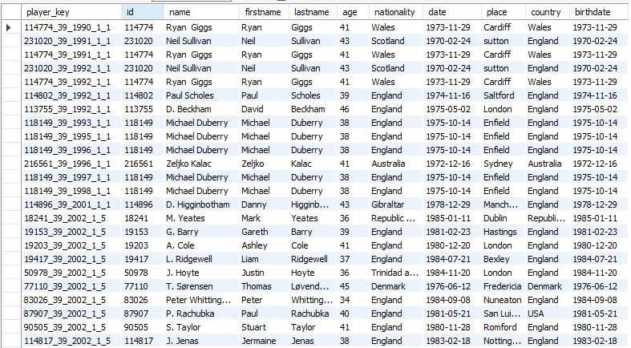
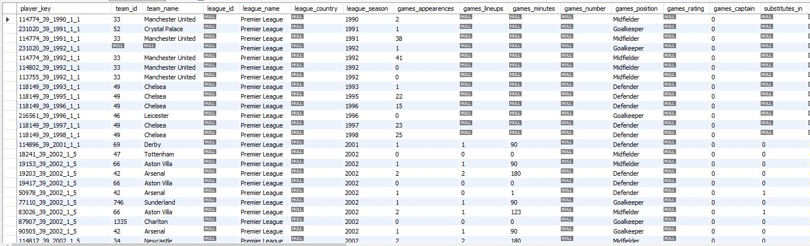

# SOCCER ETL - Extract, Transform and Load
*ETL engine designed to compile statistics from the popular Rapi Football API*

## Project Overview

As a learning endeavor, this project combines a passion for the sport of soccer with the fundamental data engineering practice known as ETL (Extract, Transform, Load). The purpose of this ETL engine is to develop a python-based series of scripts that:

1.	Perform GET requests to the Rapi Football API: https://rapidapi.com/api-sports/api/api-football
2.	Transforms the API data response into JSON data, and parses the data into python dictionaries, python lists, and pandas dataframes
3.	Uploads the processed data into 2 MySQL interrelated tables:
**player_data_dims** and **player_data_stats**

## High Level Overview of the Code

The engine is structured so that the code runs through a sequence of functions and subfunctions. 

First, the [main.py](https://github.com/mdmontes/soccer-ETL-project/blob/master/active_scripts/main.py) file executes an initial “GET” request to obtain all available “seasons” from the Rapid Football API. These seasons are placed into a python list called `season_years`. 

The entire sequence is triggered from the main.py file, and it follows two key processes: 
1.	Create Tables  
2.	Populate Tables.

### Create Tables:

Upon being called, the function receives the season parameter “2021” and begins the following:

1.	Stores the API base URL, API parameters, API keys, and database access credentials from environmental variables saved in a .env file into a series of ready-to-use variables.

2.	Executes sub-function `create_database(database_list)`, which is imported from the file [B_create_database.py](https://github.com/mdmontes/soccer-ETL-project/blob/master/active_scripts/B_create_database.py). This function takes the credentials from the database_list, and creates a database called “soccer_data”. This database will house **player_data_dims** and **player_data_stats**.

3.	Executes sub-function `get_request(url, headers, query_list)` imported from the file [C_get_request_playerdata.py](https://github.com/mdmontes/soccer-ETL-project/blob/master/active_scripts/C_get_request_playerdata.py). The function executes a “GET” request against the Rapid Football API to obtain all needed player data by season, league id, and page id. 

4.	Executes sub-function `parse_data(response, player_index)` imported from the file [D_parse_player_data.py](https://github.com/mdmontes/soccer-ETL-project/blob/master/active_scripts/D_parse_player_data.py). This function parses data returned from `get_request()` and returns 4 variables nested inside the list `consolidated_data`:

5.	Engine obtains the lists inside of `consolidated_data` and prepares “header variables” to create the tables

6.	Executes 2 final sub-functions:

      a.	`create_table(diminfo_column_headers, database_list, ‘player_data_dims’ )`

      b.	`create_table(stat_column_headers, database_list, ‘player_data_stats’ )`

    The subfunction `create_table()` is imported from the file [E_create_table.py](https://github.com/mdmontes/soccer-ETL-project/blob/master/active_scripts/E_create_table.py). Each sub-function generates SQL string queries that are submitted via a mysql.connector library. The end result is the creation of tables **player_data_dims** and **player_data_stats**.

### Populate Tables

At this point, the [main.py](https://github.com/mdmontes/soccer-ETL-project/blob/master/active_scripts/main.py) file should have successfully created the tables **player_data_dims** and **player_data_stats**.

To begin populating both tables, the engine executes `get_season_data(season_years[year])`, a function imported from the file [A_obtain_season_data.py](https://github.com/mdmontes/soccer-ETL-project/blob/master/active_scripts/A_obtain_season_data.py). The code calls this function within a for-loop that iterates through the entire list of seasons stored in the list `season_years`. 

As `get_season_data()` iterates, the engine proceeds to:

1.	Execute the sub-function `get_request(url, headers,query_list)` to call the API for the specified season, and obtain all player data for that season

    -	if `get_request()` has **no data**, the function returns a “none”, exiting the current season iteration, allowing the engine to call `get_season_data_(season_years[year])` for the next year.

    -	if `get_request()` has **data**, then the engine will store the player data into a variable to be consumed by the next subfunction

2.	Execute the sub-function `complete_table(table_names, response_current_page, response_page_max, results_per_page, url, headers, query_list, database_list)`. This function is imported from the [F_complete_table.py file](https://github.com/mdmontes/soccer-ETL-project/blob/master/active_scripts/F_complete_table.py). 

    This sub-function is designed to be a recursive function that will call and populate every record of **player_data_dims** and **player_data_stats** as it works through the API’s pagination. Throughout the recursion, `get_request()`, `parse_data()`, and `populate_table()` are called until “all pages” for one season have been requested, parsed, and populated into **player_data_dims** and **player_data_stat**.

    -	As with `create_tables()` above, the engine calls the 2 subfunctions to populate **player_data_dims** and **player_data_stat respectively**:

         `populate_table(table_names[0], player_dimdata_columns,   player_dimdata_data, database_list)`

        `populate_table(table_names[1], player_stat_columns, player_stat_data, database_list)`

    The `populate_table()` subfunction is imported from the file [G_populate_table.py](https://github.com/mdmontes/soccer-ETL-project/blob/master/active_scripts/G_populate_table.py) This function transforms the parameters submitted into pandas dataframes. These dataframes are then used to generate MySQL string commands, and submitted via a mysql.connector library command to populate **player_data_dims** and **player_data_stats**.

## Data Results and Potential Usage

The engine is currently able to yield 12,438 rows for **player_data_dims** and **player_data_stats**. Both tables are interrelated by the column "player_key":

### player_data_dims

### player_data_stats

Using the mysql.connector library, users can access the table through sql queries, and pass desired data into pandas dataframes. Through pandas dataframes, users can analyze the data.

### sample pandas data frame summarizing statistics for players that are "attackers"

likewise, users can use both pandas dataframes, and the library matplotlibs to visualize the data

### sample graph using matplotlibs showing James Milner game apperances per club:

# Improvements for next release:

1. Automation of database creation to prevent users from commenting the command `get_database()` manually in order to prevent calling the command twice
2. Integration of additional leagues from the Rapi Football API. Currently, the engine is configured to request data for the English Premier League only. Users can manually change the "league id" parameter to request data from different leagues managed by the Rapi Football API 
3. Migration of engine into Apache Airflow. Learning process currently ongoing
4. Additional EDA (exploratory data analysis) with data scientists and other data professionals to create insights, both in terms of the data, as well as for the engine 
5. Data hygiene, specifically for seasons and statistics missing data

# Data Source

All data was sourced from the Rapi Football API :https://rapidapi.com/api-sports/api/api-football

Engine depends on users having the $20/month PRO subscription as it calls the API numerous times throughout the execution.

API documentation: https://www.api-football.com/documentation-v3

# Requirements
For a list of all software requirements, please see the file [requirements.txt](https://github.com/mdmontes/soccer-ETL-project/blob/master/requirements.txt)

